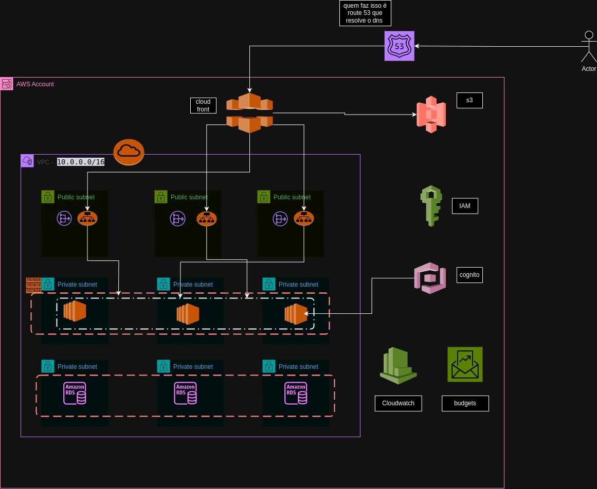

# Projeto Terraform

Este projeto utiliza Terraform para gerenciar a infraestrutura na AWS. Siga os passos abaixo para configurar e rodar o projeto na sua máquina.

## Pré-requisitos

- [Terraform](https://www.terraform.io/downloads.html) instalado
- Credenciais da AWS configuradas na sua máquina

## Passo a Passo

### 1. Clonar o repositório

Clone o repositório para a sua máquina local:

```sh
git clone <URL_DO_REPOSITORIO>
cd <NOME_DO_REPOSITORIO>

Claro! Aqui está um exemplo de README para o seu projeto Terraform:

```markdown
# Projeto Terraform

Este projeto utiliza Terraform para gerenciar a infraestrutura na AWS. Siga os passos abaixo para configurar e rodar o projeto na sua máquina.

## Pré-requisitos

- [Terraform](https://www.terraform.io/downloads.html) instalado
- Credenciais da AWS configuradas na sua máquina

## Passo a Passo

### 1. Clonar o repositório

Clone o repositório para a sua máquina local:

```sh
git clone <URL_DO_REPOSITORIO>
cd <NOME_DO_REPOSITORIO>
```

### 2. Inicializar o Terraform

Inicialize o Terraform para baixar os providers e preparar o ambiente:

```sh
terraform init
```

### 3. Formatar os arquivos Terraform

Formate os arquivos Terraform para garantir que estão semânticos:

```sh
terraform fmt -check
```

Para ver as alterações que serão feitas:

```sh
terraform fmt -diff
```

### 4. Validar a configuração

Valide a configuração para garantir que não há erros:

```sh
terraform validate
```

### 5. Planejar a infraestrutura

Crie um plano para ver o que será criado:

```sh
terraform plan
```

Para salvar o plano em um arquivo:

```sh
terraform plan -out plano.saida
```

### 6. Aplicar o plano

Aplique o plano para criar a infraestrutura:

```sh
terraform apply
```

Para aplicar automaticamente sem pedir confirmação:

```sh
terraform apply -auto-approve
```

### 7. Mostrar o plano salvo

Para visualizar o plano salvo:

```sh
terraform show plano.saida
```

### 8. Gerenciar o estado

O Terraform mantém um arquivo de estado para acompanhar os recursos criados. Para ver o estado atual:

```sh
terraform state
```

## Estrutura do Projeto

- `main.tf`: Arquivo principal com a definição dos recursos.
- `variable.tf`: Definição das variáveis utilizadas no projeto.
- `output.tf`: Definição das saídas do Terraform.
- `ec2.tf`: Definição dos recursos EC2.
- `s3.tf`: Definição dos recursos S3.
- `vpc.tf`: Definição dos recursos VPC.

## Observações

- Certifique-se de que suas credenciais da AWS estão configuradas corretamente.
- Utilize o comando `terraform refresh` para atualizar o estado dos recursos.

## Limpeza

Para destruir a infraestrutura criada:

```sh
terraform destroy
```

Para destruir automaticamente sem pedir confirmação:

```sh
terraform destroy -auto-approve
```

## Referências

- [Documentação do Terraform](https://www.terraform.io/docs)
- [Documentação da AWS](https://docs.aws.amazon.com/)

```

Este README fornece um guia passo a passo para configurar e rodar o projeto Terraform na sua máquina, além de explicar os principais comandos do Terraform.



